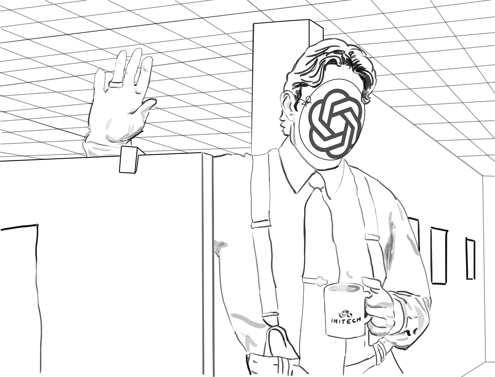

+++
title = 'Conflation Nation'
date = 2025-12-28T13:49:00.000Z
summary = "The internet is far more than the sum of the largest products and services which are built on it"

categories = ["essay"]
tags = ["industry", "philosophizing"]

[params]
image = "./images/yeeeeeeeeaaaaaahhhhhh-min.svg"

[[resources]]
[resources.params]
  title = "I almost forgot ahh, I'm also gonna need you to go ahead and replace yourself with AI, kay?"
  class = "vector"
  alt = "line drawing of the character Lumbergh from Office Space with a paper mask over his face that bears an OpenAI logo"
+++

What is the internet?

This is not as easy a question to answer as it sounds. There are a few simple and obvious answers, and while all technically correct, do not quite get to the heart of the thing.

- it is a commercial marketplace where people can exchange goods with each other
- it is a telecommunications transport people can use to talk with each other via voice or video call
- it is a broadcast medium where individuals and mega-corporations alike can publish news and media content
- It is cats. So. Many. Cats
- it is constantly becoming... something else

The above all describe the internet from a fairly romantic and optimistic frame, but it is not without it's darker side. The internet is also:

- a global surveillance network
- a haven for clandestine marketplaces which could never legally survive in the light of day
- a source of cognitive addiction and vice from social media and gambling sites engineered to a "salt & sweet" perfection to keep us engaged
- a source of propaganda; often intertwined with social media addiction, pumping negative slop into public discourse

But positive and negative, these are all the outer layers of the onion. In boring, practical terms it is a global network of computers which exchange data with each other, and that we can connect to and exchange that data with, via common protocols. More concisely still, it is a composable set of technologies, which can be used to construct any form of human expression we can come up with, plus or minus a few physical constraints.

Okay. So what of it? "That and $1.75 will get you on the subway," as the saying goes.

> What would you say... _you do_ here? \
> -- The Bobs

These layers are important to peel back, examine, and disambiguate, because when a word or idea can mean so many things all at once we can often talk past each other, nodding our head at the same words but walk away with different understandings. Much of the discourse I have followed over the past few years, as it pertains to the internet, social media, AI, and so on, seems very intent to focus on technologies as a having agency.

- "Is social media making us unhappy?"
- "Will AI take over our jobs?"
- "Was the internet's promise of liberation a lie?"

There's a curious hue to all these sentiments. By itself, no technology has any implicit valence. All intent, whether noble or malicious, is imparted to a given tool or technology by whomever wields it.

A knife and fork can be used to feed ourselves or each other. A sword and trident can both be used to inflict violence, or repel it. The same underlying technologies underpin each implementation, but whether they are used for good or ill is "[omakase](https://www.merriam-webster.com/dictionary/omakase)."

Like a knife or fork, "Social Media" doesn't _do_ anything. Each social media platform is a curated space designed by people, and the decisions made by those people inform how it should be used. Like a public park, the policy decisions that went into the park's design and creation will govern whether it encourages social connection and engagement, or is hostile to certain populations or purposes. The site formerly known as Twitter, under its new leadership, has been heavily refactored to implement [hostile architectural patterns](https://en.wikipedia.org/wiki/Hostile_architecture); boosting specific voices, and encouraging abuse to dissenting communities; not to mention a seemingly bottomless amount of grifting.

So, _AI_ is not going to "take your job," but your _boss_ might try to replace you with a generative AI product.

This kind of conflation and obfuscation long predates our current era. We do similar linguistic dances in our more traditional forms of media when speaking about uncomfortable topics like war or state violence. We use terms like "collateral damage" instead of "killing of civilians," or "thousands dead from explosion" rather than detailing who actually launched missiles, and who was killed as a result. I think we are more accustomed to spotting this kind of softening of violent conflict with passive-language, than we are when consuming information about technology and commerce, but it is similarly pernicious in the way that it deflects attention away from actors and incentives and towards... well, it's kinda hard to say, isn't it? Somebody... The internet? AI?

...and what are we then to do, try to apply pressure to "the internet" to do better? ¯\_(ツ)/¯

Which is the point. If the actors aren't clear, if intent has been conferred to an abstraction with a multitude of meanings and moving parts, then that saves all the actors from having to answer a lot of uncomfortable questions about what they are doing and why.

"Social media" as a technological concept might not be causing depression in children, but Mark Zuckerberg and Elon Musk, and those who build, market, and monetize so-called social media platforms most certainly are, whether with intent or indifference. These platforms were tools to draw people's attention.

It's also important to distinguish between what the internet is and what services are currently built on top of it. I have heard some my favorite journalists, broadcasters, and public voices decrying the ills of the internet, and then go on to describe social media platforms. It may seem pedantic, but as we try to navigate our current moment, I think it is critical to understand that the current platform architectures were not inevitable, nor are they intrinsic to the internet.

I fear that if we conflate Google, Facebook, Twitter, or myriad AI products and services with what the internet "is", we risk losing sight of remedies and alternatives; dulling our imagination of what could be built next, or our ability to observe solutions which have existed for a long time, but just need to be seen again with fresh eyes.
